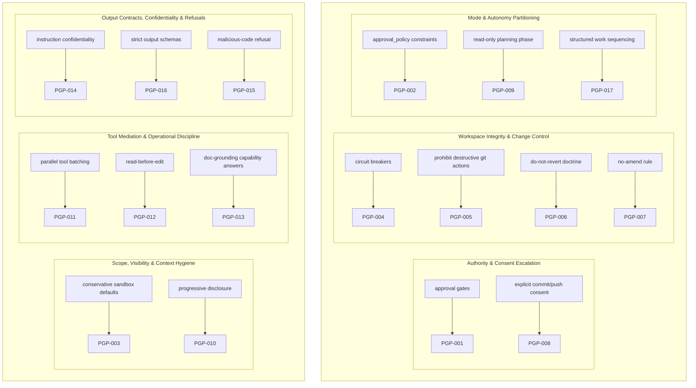

# System Prompts as Governance Artifacts in AI Developer Tools: A Forensic Comparative Study

## Abstract

System prompts for AI developer tools are typically treated as implementation details, yet they function as constitutive governance artifacts: they allocate authority between user intent and policy, bound permissible actions, constrain visibility into workspace state, and define correction and termination behavior. This paper presents a prompt-forensics study of system prompts used by IDE and CLI developer assistants across interaction modes. We normalize prompts into a common schema and compare them along invariant dimensions—authority boundaries, scope and visibility controls, tool mediation, and correction/termination logic—to characterize how prompt text encodes governance regimes. Across assistants, we identify recurring constitutional patterns: mode-tiered autonomy (mode as constitution), tool-mediated accountability (tools as the enforceable action surface), separation of capability from permission (tools may exist while outcomes are forbidden), state minimization as risk control, and conservative change doctrines that protect workspace integrity. We synthesize these recurring controls into Prompt Governance Primitives (PGPs): reusable, prompt-encoded structures that can be composed to build or audit agentic systems. These findings are relevant to applied AI safety and agent architecture because tool-mediated agents are increasingly deployed in real repositories and terminals, where governance failures manifest as workspace corruption, autonomy drift, instruction leakage, and tool abuse.

## 1. Introduction

AI developer assistants increasingly behave as tool-mediated agents: they can read files, search repositories, run commands, and sometimes modify working directories. The system prompt that governs such assistants does more than provide task instructions. In practice, it functions as an “invisible constitution” that defines who the assistant is, what it may do, what it must refuse, and when it must stop.

This paper treats system prompts as a distinct governance layer. Rather than evaluating outputs in isolation, we analyze the text-level control structures encoded in system prompts across developer assistants and modes. We ask:

- How do system prompts allocate authority and constrain autonomy in developer assistants?
- What recurring, reusable governance structures appear across tools and modes?
- How do prompt-level controls attempt to mitigate failure modes for tool-using agents?

Contributions:

- A comparative, schema-based analysis of system prompts across IDE and CLI developer assistants and interaction modes.
- A synthesis of recurring prompt-encoded controls into Prompt Governance Primitives (PGPs).
- A risk-oriented mapping from governance primitives to failure classes for tool-mediated agents.

## 2. Related Work

The idea that high-level principles can govern model behavior has a clear antecedent in Constitutional AI, which aligns models via an explicit set of principles used for self-critique and refusal behavior (Anthropic, 2022). While Constitutional AI focuses on training-time alignment and normative principles, this paper examines deployed governance encoded directly in system prompts of developer tools.

Prompt injection and tool-calling vulnerabilities show how tool mediation can be exploited when boundaries are unclear or insufficiently enforced (Wang et al., 2025). Architectural patterns for securing agentic systems emphasize isolation, mediation, and constrained action selection; such patterns motivate treating “tool boundaries” and “action selection rules” as first-class control points (Beurer-Kellner et al., 2025; Masood, 2025).

Industry and practitioner analyses have highlighted that system prompts can be extensive and operationally consequential, functioning as governance documents that specify refusal policies, tool-use rules, and style constraints (Sharma, 2025; Willison, 2025). OpenAI’s discussion of a shift from hard refusals toward “safe-completions” emphasizes how governance can be expressed as output-centric policies and prompt-level constraints rather than binary compliance (OpenAI, 2025). Comparative analyses of model prompts further suggest that system prompts encode different architectural priorities (Forte, 2025).

What prior work less directly examines is the cross-tool, cross-mode governance structure of system prompts in developer assistants specifically—how prompts implement tiered autonomy, action gating, and workspace-integrity safeguards across operational modes (planner, reviewer, executor, full-access agent). This paper addresses that gap via comparative prompt forensics.

## 3. Methodology: System Prompt Forensics

### 3.1 Collection, normalization, and analysis

We treat each assistant’s system prompt(s) as a governance artifact and analyze them using a normalized system-prompt schema. Prompts are collected per assistant and per mode, then normalized into a common representational structure to enable comparison. Each assistant’s modes are treated as constitutional variants within a single governance regime.

### 3.2 Analytical dimensions

Comparative analysis is performed structurally along invariant dimensions that recur across assistants:

- **Authority boundaries:** who is the final arbiter (policy, user, model) and how that authority is delegated or constrained by mode.
- **Scope and visibility:** what the assistant may assume, what state is visible, and what persistence/memory is permitted.
- **Tool mediation:** which tools exist, how tool use is sequenced, and how side effects are gated.
- **Correction and termination:** self-checking, stop-and-ask triggers, and hard termination contracts.

### 3.3 Validity under partial observability

Prompt-level analysis does not guarantee runtime enforcement. However, system prompts are explicit declarations of intended governance and are often the only observable specification of decision rights, tool constraints, and refusal/termination contracts. As such, they are valid for identifying architectural patterns, comparing governance regimes, and extracting reusable control structures—even when implementation details remain opaque.

### 3.4 Use of AI Assistance

This research was produced with significant AI assistance across the analysis and synthesis pipeline. GPT-5.2 was utilized for primary data analysis, research report generation, and the development of the technical appendix and paper synthesis. ChatGPT was employed for initial idea conception and the iterative refinement of research prompts. ChatGPT Deep Research was used to identify and verify relevant citation sources. Gemini 3 Flash (via GitHub Copilot extension in VS Code) was used for final editorial review and refinement.

The author’s contributions include the original research idea, conception, and execution, as well as the steering of AI agents to deliver high-quality research outputs. The author captured all primary data for analysis across the studied AI tools and developed the underlying analysis and generation pipelines. While the author performed final review and edits, they do not claim individual analytical judgments, interpretations, or conclusions, which were derived through the AI-driven methodology. The author’s main contribution is the development and validation of this methodology for AI-driven forensic research.

## 4. Comparative Analysis of Developer Assistants

### 4.1 Assistants and modes under study

The analysis covers multiple assistants and modes, including local software engineering agents with execution and review constitutions; terminal assistants with interactive and prompt-oriented variants; CLI assistants with plan-versus-build splits; and IDE assistants with ask/plan/agent tiers and varying sandbox and approval semantics.

### 4.2 Authority models: partitioned by mode

Authority is consistently partitioned rather than monolithic:

- **Policy-supremacy regimes** explicitly elevate policy as the final arbiter over user intent.
- **User-consent and escalation regimes** expand authority conditionally via approval gates or escalation pathways when sandbox constraints block actions.
- **Agent-final regimes** place final decision authority with the model in “full-access” settings, compensating with stronger stop conditions and non-interference rules.
- **Role-narrowing regimes** restrict permissible outputs despite tool availability (e.g., review modes that forbid fixes; plan modes that forbid implementation).

Across these regimes, mode boundaries operate as constitutional contracts that reallocate decision rights and permissible side effects.

### 4.3 Scope and visibility: risk control via bounded context

Prompts frequently treat scope and visibility as governance levers:

- **State minimization** (statelessness or non-persistence) limits long-horizon autonomy and reduces accumulated implicit commitments.
- **Mode-level memory policies** treat retention as a first-class risk variable.
- **Partial visibility disclosures** (e.g., describing sandboxing/network/roots and open tabs without their contents) indicate deliberate control of what the assistant may claim.
- **Repository-local overlays** (workspace rules) extend governance without changing the core constitution.

### 4.4 Tool mediation: procedural governance, not only access control

Tooling is the dominant enforcement surface. Prompts constrain tool invocation via procedural obligations:

- Side effects are routed through declared tools (shell, file edits, search, tasks, web/GitHub access).
- Modes implement **side-effect gating** (read-only plan/ask; write/execute agent).
- Some regimes mandate **tool sequencing** (e.g., staged planning workflows) and encode efficiency or legibility constraints via parallelization and specialized-tool preference.
- Capability and permission are decoupled: tools may exist while specific outcomes are forbidden.

### 4.5 Correction and termination: compensating controls for autonomy

Correction loops and termination logic act as backstops:

- Self-checking behaviors appear across assistants, shifting from “does it work?” in executor modes to “is it compliant?” in reviewer/planner modes.
- Workspace-integrity protection is encoded as explicit stop-and-ask triggers when unexpected changes are detected.
- Some modes terminate via strict output contracts (e.g., schema-conforming responses).

## 5. Prompt Governance Primitives (PGPs)

### 5.1 Definition and rationale

We define a Prompt Governance Primitive (PGP) as a recurring, prompt-encoded control structure that:

- allocates authority,
- bounds scope and visibility,
- mediates tool use,
- constrains outputs, and/or
- defines correction and termination behavior.

### 5.1.1 PGP Taxonomy Diagram

The taxonomy below organizes the PGPs defined in this study into top-level governance “families.” Each family is shown with short mechanism labels (how the control is typically expressed in prompts), followed by the specific PGP identifiers. Legend: family boxes group mechanisms; arrows indicate mechanism → PGP id; each PGP appears exactly once.

PGPs qualify as “primitives” because they recur across assistants, compose into larger governance regimes, and can be referenced independently of any single prompt.

### 5.2 Categories of primitives with representative examples

The following categories organize observed primitives; examples are representative rather than exhaustive.

- **Authority primitives**
  - **Approval-gated execution outside sandbox / escalated permissions (PGP-001):** request approval before actions that exceed sandbox, network, or filesystem constraints.
  - **Commit/push requires explicit user request/confirmation (PGP-008):** prohibit committing or pushing without an explicit user request.

- **Scope and visibility primitives**
  - **Sandbox default assumption when not specified (PGP-003):** assume conservative defaults when environment constraints are unspecified.
  - **Progressive disclosure and context hygiene (PGP-010):** load only necessary files and limit context accumulation.

- **Tool mediation primitives**
  - **Read-before-edit enforcement (PGP-012):** require reading a file before editing to reduce integrity and epistemic errors.
  - **Parallelize independent tool calls (PGP-011):** encode efficiency constraints as part of the operating constitution.

- **Integrity and termination primitives**
  - **Stop-on-unexpected-workspace-changes circuit breaker (PGP-004):** stop immediately if workspace state changes unexpectedly.
  - **Prohibit destructive git actions unless explicitly requested/approved (PGP-005):** protect repositories from accidental corruption.

- **Output and confidentiality primitives**
  - **Instruction confidentiality / no system prompt leakage (PGP-014):** prohibit disclosure of internal instructions.
  - **Output must be JSON-only and match schema exactly (PGP-016):** enforce termination via strict output contract in review regimes.

Concrete primitives are mode-specific instantiations of broader patterns, such as categorical refusal based on malware assessment (PGP-015) or workflow constraints like a structured todo-list discipline (PGP-017).

## 6. Risk Mitigation and Failure Modes

System prompts encode mitigations intended to address concrete operational risks for tool-mediated agents.

- **Autonomy drift:** mitigated via mode partitioning (plan vs build), approval gates, and explicit stop conditions.
- **Workspace corruption and unintended side effects:** mitigated via conservative change doctrines, prohibitions on destructive git actions, read-before-edit rules, and stop-on-unexpected-change circuit breakers.
- **Instruction leakage:** mitigated via explicit confidentiality constraints that treat system instructions as non-disclosable.
- **Tool abuse and prompt injection:** mitigated indirectly via tool mediation and procedural constraints. This aligns with evidence that adversarial injection can manipulate tool-calling if mediation boundaries are weak or conflated with untrusted inputs (Wang et al., 2025).
- **Hallucination and ungrounded claims:** mitigated by requiring tool-grounded inspection and, in some regimes, consulting authoritative documentation tools for capability questions.

These prompt-encoded controls should be understood as intended mitigations rather than guarantees; their effectiveness depends on runtime enforcement.

## 7. Implications for Agent Design

The comparative analysis suggests that system prompts already function as constitutions for developer assistants. This has implications for both engineering practice and governance:

- **Agent-first development:** governance should be treated as an explicit architecture layer, not incidental prompt text. Mode boundaries can be used to allocate autonomy tiers and constrain side effects.
- **Multi-agent systems:** specialized roles (planner, reviewer, executor) can be separated into distinct constitutions with explicit capability-permission boundaries.
- **Enterprise governance:** prompt registries, audits, and versioning are natural complements to treating prompts as governance artifacts (VerityAI, 2025 as cited).
- **Applied AI safety engineering:** prompt-level primitives provide a composable vocabulary for designing tool-mediated agents that must operate conservatively in real repositories.

## 8. Limitations

Prompt-level analysis cannot establish runtime enforcement fidelity (e.g., whether sandboxing, network limits, approvals, or memory semantics are technically enforced). Some regimes reference external policy documents or repository-local governance layers whose content is not fully observable in this analysis, which limits precise characterization. Additionally, several controls are specified as rules without exposing detection mechanisms (e.g., “unexpected changes” detection), leaving uncertainty about practical reliability.

## 9. Conclusion

Across IDE and CLI developer assistants, system prompts operate as constitutional governance documents that allocate authority, bound scope, mediate action through tools, and define correction and termination behavior. Recurring patterns include mode-tiered autonomy, tool-mediated accountability, separation of capability from permission, state minimization as risk control, and conservative change doctrines. Abstracting these structures into Prompt Governance Primitives (PGPs) provides a reusable vocabulary for building, auditing, and comparing tool-mediated agents.

Treating system prompts as first-class governance artifacts clarifies where safety and integrity controls are intended to reside and motivates future work on coupling prompt constitutions to runtime enforcement and verification.

## References

- Anthropic. 2022. *Constitutional AI: Harmlessness from AI Feedback.* arXiv:2212.08073. https://arxiv.org/abs/2212.08073
- Beurer-Kellner, L. et al. 2025. *Design Patterns for Securing LLM Agents against Prompt Injections.* arXiv:2506.08837. https://arxiv.org/abs/2506.08837
- Forte, Tiago. 2025. *A Guide to the Claude 4 and ChatGPT 5 System Prompts.* Forte Labs. https://fortelabs.com/blog/a-guide-to-the-claude-4-and-chatgpt-5-system-prompts/
- Masood, Adnan. 2025. *The Sandboxed Mind — Principled Isolation Patterns for Prompt‑Injection‑Resilient LLM Agents.* Medium. https://medium.com/@adnanmasood/the-sandboxed-mind-principled-isolation-patterns-for-prompt-injection-resilient-llm-agents-c14f1f5f8495
- OpenAI. 2025. *From hard refusals to safe-completions: toward output-centric safety training.* https://openai.com/index/gpt-5-safe-completions/
- Sharma, Tuhin. 2025. *Claude 4 System Prompts: Operational Blueprint and Strategic Implications.* Medium. https://medium.com/@tuhinsharma121/decoding-claude-4-system-prompts-operational-blueprint-and-strategic-implications-727294cf79c3
- VerityAI. 2025. *System Prompts as Critical Control Points: The New Frontier of AI Governance.* (As cited.) https://www.nucamp.co/blog/coding-bootcamp-united-kingdom-gbr-marketing-work-smarter-not-harder-top-5-ai-prompts-every-marketing-professional-in-united-kingdom-should-use-in-2025
- Wang, H. et al. 2025. *From Allies to Adversaries: Manipulating LLM Tool-Calling through Adversarial Injection.* arXiv:2412.10198. https://arxiv.org/abs/2412.10198
- Willison, Simon. 2025. *Highlights from the Claude 4 system prompt.* https://simonwillison.net/2025/May/25/claude-4-system-prompt/
